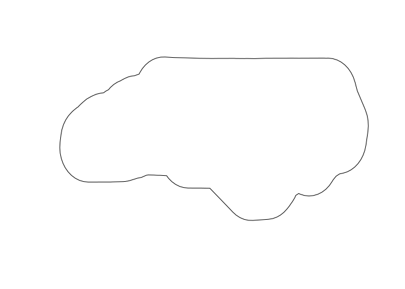

<!-- README.md is generated from README.Rmd. Please edit that file -->

# qgisprocess


<!-- badges: start -->

[](https://github.com/r-spatial/qgisprocess/actions)
[](https://www.tidyverse.org/lifecycle/#experimental)
[](https://codecov.io/gh/r-spatial/qgisprocess?branch=main)
<!-- badges: end -->

The goal of **qgisprocess** is to provide an R interface to the popular
and open source desktop geographic information system (GIS) program
[QGIS](https://qgis.org/en/site/). The package is a re-implementation of
functionality provided by the archived
[RQGIS](https://cran.r-project.org/package=RQGIS) package, which was
partially revived in the [RQGIS3](https://github.com/r-spatial/RQGIS3)
package.

## Installation

### qgisprocess

You can install the development version from
[GitHub](https://github.com/) with:

``` r
# install.packages("remotes")
remotes::install_github("r-spatial/qgisprocess")
```

### QGIS

The **qgisprocess** package wraps the [standalone `qgis_process`
command-line
utility](https://docs.qgis.org/latest/en/docs/user_manual/processing/standalone.html),
which is available in QGIS \>= 3.16.

The package is meant to support *current* QGIS releases, i.e. both the
latest and the long-term release. Although older QGIS releases are not
officially supported, it may work since QGIS 3.16. Download instructions
for all platforms are available at <https://download.qgis.org/>.

If a recent version of QGIS isn’t available for your OS, you can use the
[Geocomputation with R Docker
image](https://github.com/geocompx/docker/pkgs/container/docker) with
QGIS installed (`docker pull ghcr.io/geocompx/docker:qgis`). See the
vignette on ‘getting started’ for more information.

### Package configuration

If the automatic configuration fails (or if you have more than one
installation and would like to choose which one is used by
**qgisprocess**), you can set
`options(qgisprocess.path = "path/to/qgis_process")`. Specify the
`qgisprocess.path` option in your `.Rprofile`, to make your choices
persistent between sessions. You can run `qgis_configure()` to
reconfigure, or just `qgis_configure(use_cached_data = TRUE)` to see the
gritty details!

``` r
library(qgisprocess)
#> Attempting to load the cache ... Success!
#> QGIS version: 3.30.2-'s-Hertogenbosch
#> Having access to 1949 algorithms from 13 QGIS processing providers.
#> Run `qgis_configure(use_cached_data = TRUE)` to reload cache and get more details.
```

## Functionality

Most functions start with the `qgis_` prefix, so that functions can be
found more easily using tab completion.

The main function is `qgis_run_algorithm(algorithm = , ...)`. It
specifies the geoprocessing algorithm to be called with a
`"provider:algorithm"` formatted identifier, e.g. `"native:convexhull"`
or `"gdal:hillshade"`, and it passes the algorithm arguments as R
function arguments.

Additional functions are provided to discover available geoprocessing
algorithms, retrieve their documentation, handle processing results,
manage QGIS plugins, and more.

Spatial layers can be passed to `qgis_run_algorithm()` as file paths but
also as [sf](https://r-spatial.github.io/sf),
[stars](https://r-spatial.github.io/stars),
[terra](https://rspatial.github.io/terra) or
[raster](https://cran.r-project.org/package=raster) objects.

A structured overview of functions is available at
<https://r-spatial.github.io/qgisprocess/reference/index.html>. To get
started, read the ‘getting started’ vignette and use the [cheat
sheets](https://r-spatial.github.io/qgisprocess/articles/)!

Note that R package
[**qgis**](https://github.com/JanCaha/r_package_qgis) extends on
**qgisprocess** by providing a separate R function for each
geoprocessing algorithm. In addition, it makes the QGIS algorithm
documentation available in the corresponding R function documentation.

## Example

The following example demonstrates the
[buffer](https://docs.qgis.org/latest/en/docs/user_manual/processing_algs/qgis/vectorgeometry.html#buffer)
algorithm in action.

``` r
input <- sf::read_sf(system.file("shape/nc.shp", package = "sf"))

result <- qgis_run_algorithm(
  "native:buffer",
  INPUT = input,
  DISTANCE = 1,
  DISSOLVE = TRUE
)
#> Argument `SEGMENTS` is unspecified (using QGIS default value).
#> Using `END_CAP_STYLE = "Round"`
#> Using `JOIN_STYLE = "Round"`
#> Argument `MITER_LIMIT` is unspecified (using QGIS default value).
#> Using `OUTPUT = qgis_tmp_vector()`

result
#> <Result of `qgis_run_algorithm("native:buffer", ...)`>
#> List of 1
#>  $ OUTPUT: 'qgis_outputVector' chr "/tmp/RtmpsCZuzJ/file7d1b75a4d4eb/file7d1b1ab3935f.gpkg"

output_sf <- sf::st_as_sf(result)
plot(sf::st_geometry(output_sf))
```



You can read the help associated with an algorithm using
`qgis_show_help()`.

``` r
qgis_show_help("native:buffer")
```

It may also be useful to run an algorithm in the QGIS GUI and examine
the console ‘Input parameters’ to determine how the various input values
are translated to string processing arguments:


A list of available algorithms can be found using `qgis_algorithms()`.
When using R interactively, it may be useful to use
`View(qgis_algorithms())` to search.

``` r
qgis_algorithms()
#> # A tibble: 1,949 × 24
#>    provider         provider_title    algorithm     algorithm_id algorithm_title
#>    <chr>            <chr>             <chr>         <chr>        <chr>          
#>  1 3d               QGIS (3D)         3d:tessellate tessellate   Tessellate     
#>  2 cartographytools Cartography tools cartographyt… averagelines Average linest…
#>  3 cartographytools Cartography tools cartographyt… collapsedua… Collapse dual …
#>  4 cartographytools Cartography tools cartographyt… removecross… Remove cross r…
#>  5 cartographytools Cartography tools cartographyt… removeculde… Remove cul-de-…
#>  6 cartographytools Cartography tools cartographyt… removeround… Remove roundab…
#>  7 gdal             GDAL              gdal:aspect   aspect       Aspect         
#>  8 gdal             GDAL              gdal:assignp… assignproje… Assign project…
#>  9 gdal             GDAL              gdal:bufferv… buffervecto… Buffer vectors 
#> 10 gdal             GDAL              gdal:buildvi… buildvirtua… Build virtual …
#> # ℹ 1,939 more rows
#> # ℹ 19 more variables: provider_can_be_activated <lgl>,
#> #   provider_is_active <lgl>, provider_long_name <chr>, provider_version <chr>,
#> #   provider_warning <chr>, can_cancel <lgl>, deprecated <lgl>, group <chr>,
#> #   has_known_issues <lgl>, help_url <chr>, requires_matching_crs <lgl>,
#> #   short_description <chr>, tags <list>, default_raster_file_extension <chr>,
#> #   default_vector_file_extension <chr>, …
```

## Further reading

- A
  [paper](https://journal.r-project.org/archive/2017/RJ-2017-067/index.html)
  on the original RQGIS package published in the R Journal
- A [discussion](https://github.com/r-spatial/discuss/issues/41) options
  for running QGIS from R that led to this package
- The [pull request](https://github.com/qgis/QGIS/pull/34617) in the
  QGIS repo that led to the development of the `qgis_process`
  command-line utility
