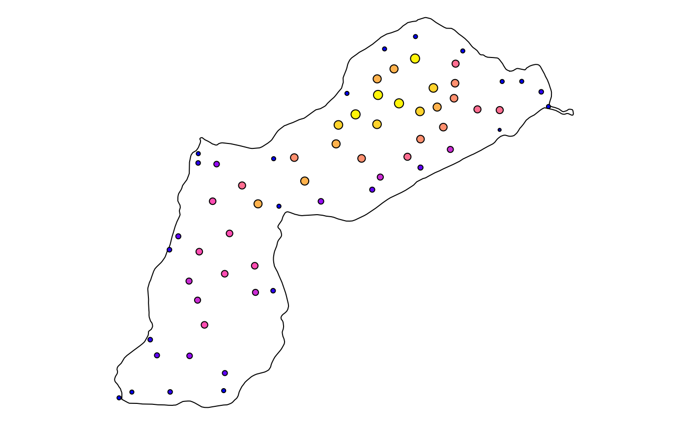

# How to use QGIS expressions in qgisprocess?

``` r
library(qgisprocess)
library(sf)
```

## Introduction

Many QGIS processing algorithms provide the possibility to use [QGIS
expressions](https://docs.qgis.org/latest/en/docs/user_manual/expressions/index.html).
If an algorithm argument expects a QGIS expression, this is typically
marked by a button in the QGIS processing dialog that opens the QGIS
expression builder (e.g. in `native:extractbyexpression`), or by a
directly integrated QGIS expression builder (e.g. in
`native:fieldcalculator`). Such arguments are of type `expression`, as
seen in the output of
[`qgis_get_argument_specs()`](https://r-spatial.github.io/qgisprocess/reference/qgis_show_help.md).

``` r
qgis_get_argument_specs("native:fieldcalculator") |> subset(name == "FORMULA")
#> # A tibble: 1 × 6
#>   name    description qgis_type default_value available_values acceptable_values
#>   <chr>   <chr>       <chr>     <list>        <list>           <list>           
#> 1 FORMULA Formula     expressi… <NULL>        <NULL>           <chr [1]>
```

Secondly, one can use expressions for *data-defined* overriding. This
means that an algorithm argument that is usually a fixed value (number,
distance, boolean, string or color) can *also* take on the value of
another field or the result of an expression. In the QGIS processing
dialog, such arguments have a ‘[data-defined
override](https://docs.qgis.org/latest/en/docs/user_manual/introduction/general_tools.html#data-defined)’
button. An example is provided by the `DISTANCE` argument of
`native:buffer`, for which we query the acceptable values below.

``` r
qgis_get_argument_specs("native:buffer") |> 
  subset(name == "DISTANCE", acceptable_values) |> 
  tidyr::unnest_longer(acceptable_values) |> 
  knitr::kable()
```

| acceptable_values                                                                                |
|:-------------------------------------------------------------------------------------------------|
| A numeric value                                                                                  |
| field:FIELD_NAME to use a data defined value taken from the FIELD_NAME field                     |
| expression:SOME EXPRESSION to use a data defined value calculated using a custom QGIS expression |

## Examples where the argument expects a QGIS expression

As example data, we use a lake polygon and a set of points that have
lake depth as attribute.

``` r
longlake_path <- system.file("longlake/longlake.gpkg", package = "qgisprocess")
longlake_depth_path <- system.file("longlake/longlake_depth.gpkg", package = "qgisprocess")
```

``` r
nrow(read_sf(longlake_depth_path))
#> [1] 64
```

In a first example, we use a QGIS expression to filter points by depth.
We can simply pass the expression as a string:

``` r
qgis_run_algorithm(
  "native:extractbyexpression",
  INPUT = longlake_depth_path,
  EXPRESSION = '"DEPTH_M" > 1'
) |>
  st_as_sf()
#> Using `OUTPUT = qgis_tmp_vector()`
#> Using `FAIL_OUTPUT = qgis_tmp_vector()`
#> Simple feature collection with 39 features and 2 fields
#> Geometry type: POINT
#> Dimension:     XY
#> Bounding box:  xmin: 410242.8 ymin: 5083519 xmax: 411466.8 ymax: 5084691
#> Projected CRS: NAD83 / UTM zone 20N
#> # A tibble: 39 × 3
#>    WAYPOINT_I DEPTH_M               geom
#>         <dbl>   <dbl>        <POINT [m]>
#>  1          8     1.4 (411466.8 5084488)
#>  2         12     1.4 (411379.1 5084490)
#>  3         17     1.4 (411292.9 5084670)
#>  4         19     1.5 (411290.8 5084593)
#>  5         20     1.5 (411286.8 5084534)
#>  6         24     1.2 (411272.2 5084333)
#>  7         25     1.5 (411244.6 5084420)
#>  8         27     1.6 (411220.3 5084500)
#>  9         29     1.7 (411205.4 5084575)
#> 10         36     1.8 (411133.2 5084691)
#> # ℹ 29 more rows
```

More often, you will want to use QGIS functions in expressions, and look
at the relationship between geometries or create new geometries.

Let’s calculate the distance between the points and the lake border, and
add it as an attribute to the points. For that we will use the
`native:fieldcalculator` algorithm.

We first create the lake border:

``` r
lake_border_path <- qgis_run_algorithm(
  "native:polygonstolines", 
  INPUT = longlake_path
) |> 
  qgis_extract_output("OUTPUT")
#> Using `OUTPUT = qgis_tmp_vector()`
```

Next, build the QGIS expression. Referring to the `INPUT` geometry in
`native:fieldcalculator` is done with the `@geometry` variable.

``` r
expr <- glue::glue("distance(
                     @geometry, 
                     geometry(
                       get_feature_by_id(
                         load_layer('{lake_border_path}', 'ogr'), 
                         1
                       )
                     )
                    )")
```

Referring to the lake border geometry in an expression is a bit
trickier, since it requires several QGIS functions. The layer can be
loaded from a filepath with the `load_layer()` function, then the first
(and only) feature is selected with `get_feature_by_id()`, and the
geometry of that feature is selected using the `geometry()` function.
These steps are needed because the `distance()` function needs
geometries to work on, not features, layers or filepaths.

Use the QGIS expression builder to look up function documentation, or
consult the online [QGIS function
documentation](https://docs.qgis.org/latest/en/docs/user_manual/expressions/functions_list.html).

Note: the `load_layer()` function is only available since QGIS 3.30.0!
In earlier versions, you needed to refer to the layer’s name in an
*existing* QGIS project, and refer to the project path in
[`qgis_run_algorithm()`](https://r-spatial.github.io/qgisprocess/reference/qgis_run_algorithm.md)
with the special `PROJECT_PATH` argument. The `load_layer()` approach
since QGIS 3.30.0 avoids the need for a QGIS project.

Now we can run the algorithm:

``` r
qgis_run_algorithm(
  "native:fieldcalculator",
  INPUT = longlake_depth_path,
  FIELD_NAME = "distance",
  FORMULA = expr
) |> 
  st_as_sf()
#> Using `FIELD_TYPE = "Decimal (double)"`
#> Argument `FIELD_LENGTH` is unspecified (using QGIS default value).
#> Argument `FIELD_PRECISION` is unspecified (using QGIS default value).
#> Using `OUTPUT = qgis_tmp_vector()`
#> Simple feature collection with 64 features and 3 fields
#> Geometry type: POINT
#> Dimension:     XY
#> Bounding box:  xmin: 409967.1 ymin: 5083354 xmax: 411658.7 ymax: 5084777
#> Projected CRS: NAD83 / UTM zone 20N
#> # A tibble: 64 × 4
#>    WAYPOINT_I DEPTH_M distance               geom
#>         <dbl>   <dbl>    <dbl>        <POINT [m]>
#>  1          2     0.8     6.22 (411658.7 5084501)
#>  2          3     0.9    38.6  (411630.3 5084560)
#>  3          5     0.8    46.7  (411553.4 5084601)
#>  4          6     0.8    49.3  (411476.4 5084600)
#>  5          8     1.4   100.   (411466.8 5084488)
#>  6         10     0.6    25.4  (411466.4 5084410)
#>  7         12     1.4   140.   (411379.1 5084490)
#>  8         16     0.8    39.4  (411321.2 5084721)
#>  9         17     1.4    93.7  (411292.9 5084670)
#> 10         19     1.5   150.   (411290.8 5084593)
#> # ℹ 54 more rows
```

## Example applying a data-defined override

Suppose that we want to create a buffer around the points with a dynamic
radius expressed as a function of `DEPTH_M`, e.g. 10 times the depth at
each point. We will use `native:buffer` for that purpose. Note: applying
a data-defined override with **qgisprocess** is only possible since QGIS
3.30.0!

Because `DISTANCE` by default expects a numeric value, you have to use
the prefix `expression:` if you want to pass an expression string.
Double quotes are used in QGIS expressions to denote fields
(attributes), but you can also omit them.

Let’s try:

``` r
buffer <- qgis_run_algorithm(
  "native:buffer",
  INPUT = longlake_depth_path,
  DISTANCE = 'expression: "DEPTH_M" * 10'
) |> 
  st_as_sf()
#> Argument `SEGMENTS` is unspecified (using QGIS default value).
#> Using `END_CAP_STYLE = "Round"`
#> Using `JOIN_STYLE = "Round"`
#> Argument `MITER_LIMIT` is unspecified (using QGIS default value).
#> Argument `DISSOLVE` is unspecified (using QGIS default value).
#> Argument `SEPARATE_DISJOINT` is unspecified (using QGIS default value).
#> Using `OUTPUT = qgis_tmp_vector()`
```

So from the 64 points we have created 64 polygons:

``` r
st_geometry_type(buffer) |> as.character() |> table()
#> 
#> MULTIPOLYGON 
#>           64
```

Plot the result:

``` r
oldpar <- par(mar = rep(0.1, 4))
plot(read_sf(lake_border_path) |> st_geometry())
plot(buffer[, "DEPTH_M"], add = TRUE)
```



``` r
par(oldpar)
```

If you just want to refer to the value of another attribute, then you
can also use the `field:` prefix instead, *without* double quotes around
the attribute name and *without* spaces:

``` r
qgis_run_algorithm(
  "native:buffer",
  INPUT = longlake_depth_path,
  DISTANCE = "field:DEPTH_M"
) |> 
  st_as_sf()
```
