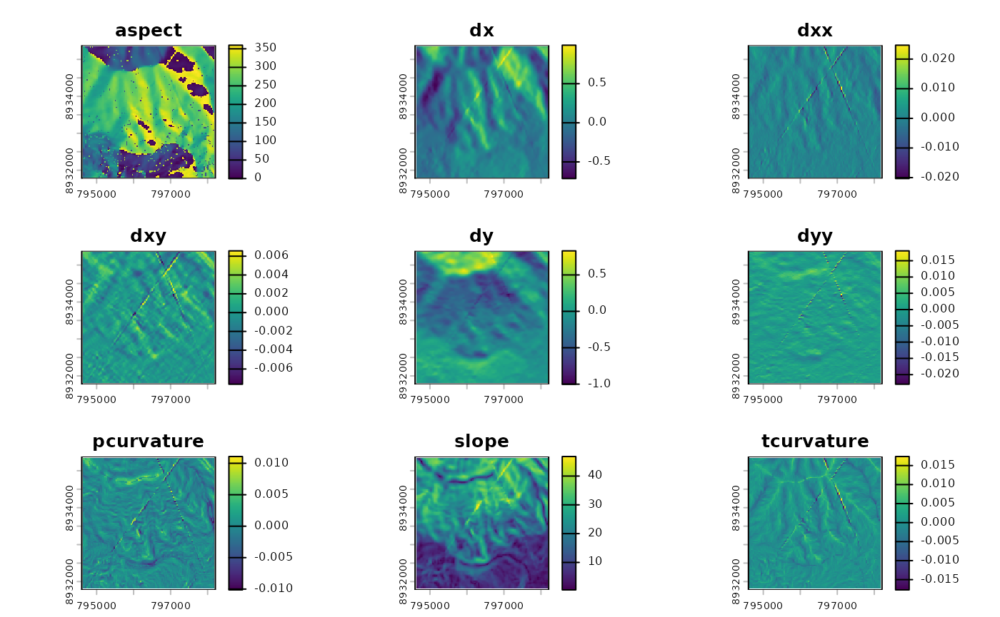

# Getting started with qgisprocess

For a very short introduction to **qgisprocess**, visit the
[homepage](https://r-spatial.github.io/qgisprocess/).

Here you will learn about package configuration, about basic usage
illustrated by two examples, and how to pipe results into a next
geoprocessing step.

## Setting up the system

**qgisprocess** is basically a wrapper around the standalone command
line tool
[`qgis_process`](https://docs.qgis.org/latest/en/docs/user_manual/processing/standalone.html).
Therefore, you need to have installed QGIS on your system as well as
third-party providers such as GRASS GIS and SAGA to access and run all
geoalgorithms provided through `qgis_process` from within R.

The package is meant to support *current* QGIS releases, i.e. both the
latest and the long-term release. Although older QGIS releases are not
officially supported, **qgisprocess** might work with QGIS versions
\>=3.16. Download instructions for all platforms are available at
<https://download.qgis.org/>.

To facilitate using **qgisprocess**, we have created a docker image that
already comes with the needed software packages. You can pull it from
Github’s container registry by running:

``` sh
docker pull ghcr.io/geocompx/docker:qgis
```

For a more detailed introduction on how to get started with docker,
please refer to <https://github.com/geocompx/docker>.

## Package configuration

Since **qgisprocess** depends on the command line tool `qgis_process`,
it already tries to detect `qgis_process` on your system when it is
being loaded, and complains if it cannot find it.

``` r
library("qgisprocess")
#> QGIS version: 3.44.7-Solothurn
#> Having access to 409 algorithms from 4 QGIS processing providers.
#> Run `qgis_configure(use_cached_data = TRUE)` to reload cache and get more details.
#> >>> Run `qgis_enable_plugins()` to enable 3 disabled plugins and access
#>     their algorithms: grassprovider, processing,
#>     processing_saga_nextgen
```

When loading **qgisprocess** for the first time, it will cache among
others the path to `qgis_process`, the QGIS version and the list of
known algorithms. When loading **qgisprocess** in later R sessions, the
cache file is read instead for speed-up, on condition that it is still
valid. Therefore, usually you don’t have to do any configuration
yourself, unless there’s a message telling you to do so.

If you are interested in the details about this process, e.g. how
**qgisprocess** detected `qgis_process`, run
`qgis_configure(use_cached_data = TRUE)`.

``` r
qgis_configure(use_cached_data = TRUE)
#> Checking configuration in cache file (/home/runner/.cache/R-qgisprocess/cache-0.4.1.9229.rds)
#> Checking cached QGIS version with version reported by 'qgis_process' ...
#> QGIS versions match! (3.44.7-Solothurn)
#> Checking cached QGIS plugins (and state) with those reported by 'qgis_process' ...
#> QGIS plugins match! (0 processing provider plugin(s) enabled)
#> 
#> >>> Run `qgis_enable_plugins()` to enable 3 disabled plugins and access
#>     their algorithms: grassprovider, processing,
#>     processing_saga_nextgen
#> 
#> Restoring configuration from '/home/runner/.cache/R-qgisprocess/cache-0.4.1.9229.rds'
#> QGIS version: 3.44.7-Solothurn
#> Using 'qgis_process' in the system PATH.
#> >>> If you need another installed QGIS instance, run `qgis_configure()`;
#>     see `?qgis_configure` if you need to preset the path of 'qgis_process'.
#> Using JSON for output serialization.
#> Using JSON for input serialization.
#> 0 out of 3 available processing provider plugins are enabled.
#> Having access to 409 algorithms from 4 QGIS processing providers.
#> Use qgis_algorithms(), qgis_providers(), qgis_plugins(), qgis_path() and
#> qgis_version() to inspect the cache environment.
```

If needed the cache will be rebuilt automatically upon loading the
package. This is the case when the QGIS version or the location of the
`qgis_process` command-line utility has changed, user-settings (e.g. the
option `qgisprocess.path`) have been altered or a changed state of the
processing provider plugins (enabled vs. disabled) has been detected.

Rebuilding the cache can be triggered manually by running
[`qgis_configure()`](https://r-spatial.github.io/qgisprocess/reference/qgis_configure.md)
(its default is `use_cached_data = FALSE`).

To determine the location of `qgis_process`,
[`qgis_configure()`](https://r-spatial.github.io/qgisprocess/reference/qgis_configure.md)
first checks if the R option `qgisprocess.path` or the global
environment variable `R_QGISPROCESS_PATH` has been set. This already
indicates that you can specify one of these settings in case
`qgis_process` has not been installed in one of the most common
locations or if there are multiple QGIS versions available. If this is
the case, set `options(qgisprocess.path = '/path/to/qgis_process')` or
set the environment variable (e.g. in `.Renviron`) and run
[`qgis_configure()`](https://r-spatial.github.io/qgisprocess/reference/qgis_configure.md).
Under Windows make sure to indicate the path to the
`qgis_process-qgis.bat` file, e.g.,

``` r
# specify path to QGIS installation on Windows 
options(qgisprocess.path = "C:/Program Files/QGIS 3.28/bin/qgis_process-qgis.bat")
# or use the QGIS nightly version (if installed via OSGeo4W)
# options(qgisprocess.path = "C:/OSGeo4W64/bin/qgis_process-qgis-dev.bat")
qgis_configure() # or use library(qgisprocess) if package was not loaded yet
```

Assuming that package loading or
[`qgis_configure()`](https://r-spatial.github.io/qgisprocess/reference/qgis_configure.md)
ran successfully, we can check which QGIS version our system is running
(it takes this from the cache):

``` r
qgis_version()
#> [1] "3.44.7-Solothurn"
```

Next, let’s check which plugins are at our disposal:

``` r
qgis_plugins()
#> # A tibble: 3 × 2
#>   name                    enabled
#>   <chr>                   <lgl>  
#> 1 grassprovider           FALSE  
#> 2 processing              FALSE  
#> 3 processing_saga_nextgen FALSE
```

Since we will use GRASS GIS and SAGA later on, you must have GRASS GIS
and SAGA version \> 7 installed on your system. You also need to install
the third-party plugin ‘SAGA Next Generation’ in the QGIS GUI. The GRASS
provider plugin is already built-in in QGIS.

Then, let’s enable both plugins:

``` r
qgis_enable_plugins(c("grassprovider", "processing_saga_nextgen"))
```

Now, let’s list all available providers including available third-party
applications:

``` r
qgis_providers()
#> # A tibble: 6 × 3
#>   provider provider_title    algorithm_count
#>   <chr>    <chr>                       <int>
#> 1 gdal     GDAL                           57
#> 2 grass    GRASS                         307
#> 3 qgis     QGIS                           35
#> 4 3d       QGIS (3D)                       1
#> 5 native   QGIS (native c++)             316
#> 6 sagang   SAGA Next Gen                 509
```

This tells us that we can also use the third-party providers GDAL, GRASS
and SAGA through the QGIS interface.

## Basic usage

### First example

To get the complete overview of available (cached) geoalgorithms, run:

``` r
algs <- qgis_algorithms()
algs
#> # A tibble: 1,225 × 25
#>    provider provider_title algorithm                algorithm_id algorithm_title
#>    <chr>    <chr>          <chr>                    <chr>        <chr>          
#>  1 3d       QGIS (3D)      3d:tessellate            tessellate   Tessellate     
#>  2 gdal     GDAL           gdal:aspect              aspect       Aspect         
#>  3 gdal     GDAL           gdal:assignprojection    assignproje… Assign project…
#>  4 gdal     GDAL           gdal:buffervectors       buffervecto… Buffer vectors 
#>  5 gdal     GDAL           gdal:buildvirtualraster  buildvirtua… Build virtual …
#>  6 gdal     GDAL           gdal:buildvirtualvector  buildvirtua… Build virtual …
#>  7 gdal     GDAL           gdal:cliprasterbyextent  cliprasterb… Clip raster by…
#>  8 gdal     GDAL           gdal:cliprasterbymaskla… cliprasterb… Clip raster by…
#>  9 gdal     GDAL           gdal:clipvectorbyextent  clipvectorb… Clip vector by…
#> 10 gdal     GDAL           gdal:clipvectorbypolygon clipvectorb… Clip vector by…
#> # ℹ 1,215 more rows
#> # ℹ 20 more variables: provider_can_be_activated <lgl>,
#> #   provider_is_active <lgl>, provider_long_name <chr>, provider_version <chr>,
#> #   provider_warning <chr>, can_cancel <lgl>, deprecated <lgl>, group <chr>,
#> #   has_known_issues <lgl>, help_url <chr>, requires_matching_crs <lgl>,
#> #   short_description <chr>, tags <list>, default_raster_file_format <chr>,
#> #   default_raster_file_extension <chr>, default_vector_file_extension <chr>, …
```

For a directed search, use
[`qgis_search_algorithms()`](https://r-spatial.github.io/qgisprocess/reference/qgis_search_algorithms.md):

``` r
qgis_search_algorithms(algorithm = "buffer", group = "[Vv]ector")
#> # A tibble: 10 × 5
#>    provider provider_title    group                algorithm     algorithm_title
#>    <chr>    <chr>             <chr>                <chr>         <chr>          
#>  1 gdal     GDAL              Vector geoprocessing gdal:bufferv… Buffer vectors 
#>  2 gdal     GDAL              Vector geoprocessing gdal:oneside… One side buffer
#>  3 grass    GRASS             Vector (v.*)         grass:v.buff… v.buffer       
#>  4 native   QGIS (native c++) Vector geometry      native:buffer Buffer         
#>  5 native   QGIS (native c++) Vector geometry      native:buffe… Variable width…
#>  6 native   QGIS (native c++) Vector geometry      native:multi… Multi-ring buf…
#>  7 native   QGIS (native c++) Vector geometry      native:singl… Single sided b…
#>  8 native   QGIS (native c++) Vector geometry      native:taper… Tapered buffers
#>  9 native   QGIS (native c++) Vector geometry      native:wedge… Create wedge b…
#> 10 sagang   SAGA Next Gen     Vector general       sagang:shape… Shapes buffer
```

Since we have also installed GRASS GIS and SAGA, over 1000 geoalgorithms
are at our disposal. To find out about a specific geoalgorithm and a
description of its arguments, use
[`qgis_show_help()`](https://r-spatial.github.io/qgisprocess/reference/qgis_show_help.md),
e.g.:

``` r
qgis_show_help("native:buffer")
## Buffer (native:buffer)
## 
## ----------------
## Description
## ----------------
## This algorithm computes a buffer area for all the features in an input layer, using a fixed or dynamic distance.
## 
## The segments parameter controls the number of line segments to use to approximate a quarter circle when creating rounded offsets.
## 
## ...
```

To find out the arguments of a specific geoalgorithm, run:

``` r
qgis_get_argument_specs("native:buffer")
#> # A tibble: 9 × 6
#>   name    description qgis_type default_value available_values acceptable_values
#>   <chr>   <chr>       <chr>     <list>        <list>           <list>           
#> 1 INPUT   Input layer source    <NULL>        <NULL>           <chr [1]>        
#> 2 DISTAN… Distance    distance  <int [1]>     <NULL>           <chr [3]>        
#> 3 SEGMEN… Segments    number    <int [1]>     <NULL>           <chr [3]>        
#> 4 END_CA… End cap st… enum      <int [1]>     <chr [3]>        <chr [2]>        
#> 5 JOIN_S… Join style  enum      <int [1]>     <chr [3]>        <chr [2]>        
#> 6 MITER_… Miter limit number    <int [1]>     <NULL>           <chr [3]>        
#> 7 DISSOL… Dissolve r… boolean   <lgl [1]>     <NULL>           <chr [4]>        
#> 8 SEPARA… Keep disjo… boolean   <lgl [1]>     <NULL>           <chr [4]>        
#> 9 OUTPUT  Buffered    sink      <NULL>        <NULL>           <chr [1]>
```

And finally run it with
[`qgis_run_algorithm()`](https://r-spatial.github.io/qgisprocess/reference/qgis_run_algorithm.md):

``` r
# if needed, first install spDataLarge:
# remotes::install_github("Nowosad/spDataLarge")
data("random_points", package = "spDataLarge")
result <- qgis_run_algorithm("native:buffer", INPUT = random_points, DISTANCE = 50)
#> Argument `SEGMENTS` is unspecified (using QGIS default value).
#> Using `END_CAP_STYLE = "Round"`
#> Using `JOIN_STYLE = "Round"`
#> Argument `MITER_LIMIT` is unspecified (using QGIS default value).
#> Argument `DISSOLVE` is unspecified (using QGIS default value).
#> Argument `SEPARATE_DISJOINT` is unspecified (using QGIS default value).
#> Using `OUTPUT = qgis_tmp_vector()`
```

As a convenience to the user,
[`qgis_run_algorithm()`](https://r-spatial.github.io/qgisprocess/reference/qgis_run_algorithm.md)
reports all unspecified and automatically chosen arguments. If you want
to have even more information on what is going on in the background, set
`.quiet` to `FALSE`. The `result` object is of class `qgis_result` and
contains the path to the output file created by `qgis_process` (when not
explicitly setting an output filepath, **qgisprocess** creates it
automatically for you). The output filepath can be extracted with
[`qgis_extract_output()`](https://r-spatial.github.io/qgisprocess/reference/qgis_extract_output.md).
`qgis_result` objects are of type `list` which, aside from the
geoprocessing result, also contain debugging information about the used
algorithm, input arguments and messages from the processing step. See
[`?qgis_result_status`](https://r-spatial.github.io/qgisprocess/reference/qgis_result_status.md)
for various convenience functions to extract all of this information
easily from `qgis_result` objects.

For QGIS 3.24 and later,
[`qgis_run_algorithm()`](https://r-spatial.github.io/qgisprocess/reference/qgis_run_algorithm.md)
passes the input arguments to QGIS as a JSON string. The JSON input
string is also included in `qgis_result` objects. Moreover, the user can
specify input arguments directly as JSON in
[`qgis_run_algorithm()`](https://r-spatial.github.io/qgisprocess/reference/qgis_run_algorithm.md).
That is useful since input parameters can be copied from the QGIS GUI as
JSON. This will be demonstrated in a separate tutorial.

``` r
# inspect the result object
class(result)
#> [1] "qgis_result"
names(result)
#> [1] "OUTPUT"           ".algorithm"       ".args"            ".raw_json_input" 
#> [5] ".processx_result"
result # only prints the output element(s)
#> <Result of `qgis_run_algorithm("native:buffer", ...)`>
#> List of 1
#>  $ OUTPUT: 'qgis_outputVector' chr "/tmp/RtmpTlq9F8/file34545a2d2926/file345453848bc6.gpkg"
```

To read in the QGIS output and visualize it, we can run:

``` r
library("sf")
library("mapview")
# attach QGIS output
# either do it "manually":
buf <- read_sf(qgis_extract_output(result, "OUTPUT"))
# or use the st_as_sf.qgis_result method:
buf <- sf::st_as_sf(result)
# plot your result
mapview(buf, col.regions = "blue") + 
  mapview(random_points, col.regions = "red", cex = 3)
```

You can convert each QGIS algorithm into an R function with
[`qgis_function()`](https://r-spatial.github.io/qgisprocess/reference/qgis_function.md).
So using our buffer example from above, we could also run:

``` r
# create a function
qgis_buffer <- qgis_function("native:buffer")
# run the function
result <- qgis_buffer(INPUT = random_points, DISTANCE = 50)
```

This is basically what package
[qgis](https://github.com/JanCaha/r_package_qgis) is doing for each
available QGIS function while also providing an R help file for each
function. Hence, if you prefer running QGIS with callable R functions,
check it out.

### Second example

As a second example, let’s have a look at how to do raster processing
running GRASS GIS in the background. To compute various terrain
attributes of a digital elevation model, we can use
`grass:r.slope.aspect`.

*Note: in QGIS versions \< 3.36, the processing provider was still
called `grass7` (even though this provider works with GRASS GIS 8).* *So
if you have an older QGIS version, you must name the algorithms as
`grass7:r.slope.aspect` etc.*

[`qgis_get_description()`](https://r-spatial.github.io/qgisprocess/reference/qgis_show_help.md)
(also included in
[`qgis_show_help()`](https://r-spatial.github.io/qgisprocess/reference/qgis_show_help.md))
gives us the general description of the algorithm.

``` r
qgis_get_description("grass:r.slope.aspect")
#>                                                                                          grass:r.slope.aspect 
#> "Generates raster layers of slope, aspect, curvatures and partial derivatives from a elevation raster layer."
```

We can find out about the arguments again with the help of
[`qgis_get_argument_specs()`](https://r-spatial.github.io/qgisprocess/reference/qgis_show_help.md).

``` r
qgis_get_argument_specs("grass:r.slope.aspect")
#> # A tibble: 21 × 6
#>    name   description qgis_type default_value available_values acceptable_values
#>    <chr>  <chr>       <chr>     <list>        <list>           <list>           
#>  1 eleva… Elevation   raster    <NULL>        <NULL>           <chr [1]>        
#>  2 format Format for… enum      <int [1]>     <chr [2]>        <chr [2]>        
#>  3 preci… Type of ou… enum      <int [1]>     <chr [3]>        <chr [2]>        
#>  4 -a     Do not ali… boolean   <lgl [1]>     <NULL>           <chr [4]>        
#>  5 -e     Compute ou… boolean   <lgl [1]>     <NULL>           <chr [4]>        
#>  6 -n     Create asp… boolean   <lgl [1]>     <NULL>           <chr [4]>        
#>  7 zscale Multiplica… number    <dbl [1]>     <NULL>           <chr [3]>        
#>  8 min_s… Minimum sl… number    <dbl [1]>     <NULL>           <chr [3]>        
#>  9 slope  Slope       rasterDe… <NULL>        <NULL>           <chr [1]>        
#> 10 aspect Aspect      rasterDe… <NULL>        <NULL>           <chr [1]>        
#> # ℹ 11 more rows
```

[`qgis_get_output_specs()`](https://r-spatial.github.io/qgisprocess/reference/qgis_show_help.md)
shows the different outputs that will be calculated:

``` r
qgis_get_output_specs("grass:r.slope.aspect")
#> # A tibble: 9 × 3
#>   name       description                                   qgis_output_type
#>   <chr>      <chr>                                         <chr>           
#> 1 aspect     Aspect                                        outputRaster    
#> 2 dx         First order partial derivative dx (E-W slope) outputRaster    
#> 3 dxx        Second order partial derivative dxx           outputRaster    
#> 4 dxy        Second order partial derivative dxy           outputRaster    
#> 5 dy         First order partial derivative dy (N-S slope) outputRaster    
#> 6 dyy        Second order partial derivative dyy           outputRaster    
#> 7 pcurvature Profile curvature                             outputRaster    
#> 8 slope      Slope                                         outputRaster    
#> 9 tcurvature Tangential curvature                          outputRaster
```

Now let us calculate the terrain attributes.

``` r
library("terra")
# attach digital elevation model from Mt. Mongón (Peru)
dem <- rast(system.file("raster/dem.tif", package = "spDataLarge"))
# if not already done, enable the GRASS GIS plugin
# qgis_enable_plugins("grassprovider")
info <- qgis_run_algorithm(alg = "grass:r.slope.aspect", elevation = dem)
```

Just printing the `info` object shows which output files have been made:

``` r
info
#> <Result of `qgis_run_algorithm("grass:r.slope.aspect", ...)`>
#> List of 9
#>  $ aspect    : 'qgis_outputRaster' chr "/tmp/RtmpTlq9F8/file34545a2d2926/file34543390c46d.tif"
#>  $ dx        : 'qgis_outputRaster' chr "/tmp/RtmpTlq9F8/file34545a2d2926/file345465ddd0dc.tif"
#>  $ dxx       : 'qgis_outputRaster' chr "/tmp/RtmpTlq9F8/file34545a2d2926/file345431f60d18.tif"
#>  $ dxy       : 'qgis_outputRaster' chr "/tmp/RtmpTlq9F8/file34545a2d2926/file34546578096.tif"
#>  $ dy        : 'qgis_outputRaster' chr "/tmp/RtmpTlq9F8/file34545a2d2926/file345434962175.tif"
#>  $ dyy       : 'qgis_outputRaster' chr "/tmp/RtmpTlq9F8/file34545a2d2926/file34547e119bbe.tif"
#>  $ pcurvature: 'qgis_outputRaster' chr "/tmp/RtmpTlq9F8/file34545a2d2926/file3454611195af.tif"
#>  $ slope     : 'qgis_outputRaster' chr "/tmp/RtmpTlq9F8/file34545a2d2926/file345464472216.tif"
#>  $ tcurvature: 'qgis_outputRaster' chr "/tmp/RtmpTlq9F8/file34545a2d2926/file3454ea0816.tif"
```

Combine these output rasters as a multi-layered `SpatRaster` object and
plot it:

``` r
# just keep the names of output rasters
nms <- qgis_get_output_specs("grass:r.slope.aspect")$name
# read in the output rasters 
r <- info[nms] |>
  unlist() |>
  rast() |>
  as.numeric()
names(r) <- nms
# plot the output
plot(r)
```



An alternative way to combine the rasters is given below.

``` r
r <- lapply(info[nms], \(x) as.numeric(qgis_as_terra(x))) |> 
  rast()
```

Since we now have many terrain attributes at our disposal, let us take
the opportunity to add their values to points laying on top of them with
the help of the SAGA algorithm `sagang:addrastervaluestopoints`.

``` r
qgis_get_argument_specs("sagang:addrastervaluestopoints")
#> # A tibble: 4 × 6
#>   name    description qgis_type default_value available_values acceptable_values
#>   <chr>   <chr>       <chr>     <list>        <list>           <list>           
#> 1 SHAPES  Points      source    <NULL>        <NULL>           <chr [1]>        
#> 2 GRIDS   Grids       multilay… <NULL>        <NULL>           <list [0]>       
#> 3 RESULT  Result      vectorDe… <NULL>        <NULL>           <chr [1]>        
#> 4 RESAMP… Resampling  enum      <int [1]>     <chr [4]>        <chr [2]>
```

The `GRIDS` argument is of type multilayer. To pass multiple layers to
one argument, you can either repeat the corresponding argument as often
as needed …

``` r
rp_tp <- qgis_run_algorithm(
  "sagang:addrastervaluestopoints",
  SHAPES = random_points,
  GRIDS = qgis_extract_output(info, "aspect"),
  GRIDS = qgis_extract_output(info, "slope"),
  GRIDS = qgis_extract_output(info, "tcurvature"),
  RESAMPLING = 0)
#> Using `RESULT = qgis_tmp_vector()`
```

… or you can pass to it all needed layers in one list. One could use the
[`list()`](https://rdrr.io/r/base/list.html) command but it is
recommendended to use the
[`qgis_list_input()`](https://r-spatial.github.io/qgisprocess/reference/qgis_list_input.md)
function which is more robust, and therefore will also support
non-JSON-input configurations (e.g. QGIS \< 3.24).

``` r
rp_tp <- qgis_run_algorithm(
  "sagang:addrastervaluestopoints",
  SHAPES = random_points,
  GRIDS = qgis_list_input(
    qgis_extract_output(info, "aspect"),
    qgis_extract_output(info, "slope"),
    qgis_extract_output(info, "tcurvature")
  ),
  RESAMPLING = 0)
```

To verify that it worked, read in the output.

``` r
sf::st_as_sf(rp_tp)
#> Simple feature collection with 100 features and 5 fields
#> Geometry type: POINT
#> Dimension:     XYZ
#> Bounding box:  xmin: 795551.4 ymin: 8932370 xmax: 797242.3 ymax: 8934800
#> z_range:       zmin: 0 zmax: 0
#> Projected CRS: +proj=utm +zone=17 +south +ellps=WGS84 +units=m +no_defs
#> # A tibble: 100 × 6
#>       id  spri file34543390c46d file345464472216 file3454ea0816
#>    <int> <int>            <dbl>            <dbl>          <dbl>
#>  1     1     4            246.              4.85      -0.000425
#>  2     2     4            126.              4.23      -0.00246 
#>  3     3     3            301.              8.57      -0.00111 
#>  4     4     2             96.9             6.63       0.00100 
#>  5     5     4            337.             14.3       -0.000145
#>  6     6     5            245.             10.6       -0.000484
#>  7     7     6            272.              9.47      -0.000532
#>  8     8     2            307.              6.21      -0.000236
#>  9     9     3             67.8            11.5       -0.00135 
#> 10    10     3            107.             12.9        0.00134 
#> # ℹ 90 more rows
#> # ℹ 1 more variable: geom <POINT [m]>
```

## Piping

`qgis_process` does not lend itself naturally to piping because its
first argument is the name of a geoalgorithm instead of a data object.
[`qgis_run_algorithm_p()`](https://r-spatial.github.io/qgisprocess/reference/qgis_run_algorithm_p.md)
circumvents this by accepting a `.data` object as its first argument,
and pipes this data object into the first argument of a geoalgorithm
assuming that the specified geoalgorithm needs a data input object as
its first argument.

``` r
system.file("longlake/longlake_depth.gpkg", package = "qgisprocess") |>
  qgis_run_algorithm_p("native:buffer", DISTANCE = 50)
#> Argument `SEGMENTS` is unspecified (using QGIS default value).
#> Using `END_CAP_STYLE = "Round"`
#> Using `JOIN_STYLE = "Round"`
#> Argument `MITER_LIMIT` is unspecified (using QGIS default value).
#> Argument `DISSOLVE` is unspecified (using QGIS default value).
#> Argument `SEPARATE_DISJOINT` is unspecified (using QGIS default value).
#> Using `OUTPUT = qgis_tmp_vector()`
#> <Result of `qgis_run_algorithm("native:buffer", ...)`>
#> List of 1
#>  $ OUTPUT: 'qgis_outputVector' chr "/tmp/RtmpTlq9F8/file34545a2d2926/file3454534cd3ea.gpkg"
```

If `.data` is a `qgis_result` object,
[`qgis_run_algorithm_p()`](https://r-spatial.github.io/qgisprocess/reference/qgis_run_algorithm_p.md)
automatically tries to select an element named `OUTPUT`. However, if the
output has another name (e.g., `DEM_PREPROC` as in the example below) or
if there are multiple output elements to choose from (e.g.,
`sagang:sagawetnessindex` has four output rasters, check with
`qgis_outputs("sagang:sagawetnessindex")`), you can specify the wanted
output object via the `.select` argument. Please note that we make sure
that temporary output raster files, i.e., all output rasters we do not
specifically name ourselves, should use SAGA’s native raster file format
by setting the `qgisprocess.tmp_raster_ext` option to `.sdat`. Using the
default raster output format `.tif` might lead to trouble depending on
the installed versions of third-party packages (GDAL, SAGA, etc.).

``` r
dem <- system.file("raster/dem.tif", package = "spDataLarge")
# in case you need to enable the SAGA next generation algorithms, run the following line:
# qgis_enable_plugins("processing_saga_nextgen")

oldopt <- options(qgisprocess.tmp_raster_ext = ".sdat")
qgis_run_algorithm(algorithm = "sagang:sinkremoval", DEM = dem,
                   METHOD = 1) |>
  qgis_run_algorithm_p("sagang:sagawetnessindex", .select = "DEM_PREPROC")
#> Argument `SINKROUTE` is unspecified (using QGIS default value).
#> Using `DEM_PREPROC = qgis_tmp_raster()`
#> Argument `THRESHOLD` is unspecified (using QGIS default value).
#> Argument `THRSHEIGHT` is unspecified (using QGIS default value).
#> Argument `WEIGHT` is unspecified (using QGIS default value).
#> Using `AREA = qgis_tmp_raster()`
#> Using `SLOPE = qgis_tmp_raster()`
#> Using `AREA_MOD = qgis_tmp_raster()`
#> Using `TWI = qgis_tmp_raster()`
#> Argument `SUCTION` is unspecified (using QGIS default value).
#> Using `AREA_TYPE = "[0] total catchment area"`
#> Using `SLOPE_TYPE = "[0] local slope"`
#> Argument `SLOPE_MIN` is unspecified (using QGIS default value).
#> Argument `SLOPE_OFF` is unspecified (using QGIS default value).
#> Argument `SLOPE_WEIGHT` is unspecified (using QGIS default value).
#> <Result of `qgis_run_algorithm("sagang:sagawetnessindex", ...)`>
#> List of 4
#>  $ AREA    : 'qgis_outputRaster' chr "/tmp/RtmpTlq9F8/file34545a2d2926/file34544f16b738.sdat"
#>  $ AREA_MOD: 'qgis_outputRaster' chr "/tmp/RtmpTlq9F8/file34545a2d2926/file34548045445.sdat"
#>  $ SLOPE   : 'qgis_outputRaster' chr "/tmp/RtmpTlq9F8/file34545a2d2926/file3454123a278a.sdat"
#>  $ TWI     : 'qgis_outputRaster' chr "/tmp/RtmpTlq9F8/file34545a2d2926/file34547129ee44.sdat"
```

When piping,
[`qgis_run_algorithm_p()`](https://r-spatial.github.io/qgisprocess/reference/qgis_run_algorithm_p.md)
automatically cleans up after you by deleting intermediate results. This
avoids cluttering your system when running geoalgorithms on large
spatial data files. To turn off this behavior, set `.clean` to `FALSE`.

Of course, you can also pipe to
[`qgis_run_algorithm()`](https://r-spatial.github.io/qgisprocess/reference/qgis_run_algorithm.md)
by manually extracting the `OUTPUT` object and redirecting it to the
appropriate input argument of the next processing step. This avoids
ambiguity and allows for greater flexibility though it might not be as
convenient as
[`qgis_run_algorithm_p()`](https://r-spatial.github.io/qgisprocess/reference/qgis_run_algorithm_p.md).
For example, intermediate results remain on disk for the duration of
your R session, unless you manually call
[`qgis_clean_result()`](https://r-spatial.github.io/qgisprocess/reference/qgis_clean_result.md)
on a result object.

``` r
result <- qgis_run_algorithm(algorithm = "sagang:sinkremoval", DEM = dem, 
                         METHOD = 1) |>
  qgis_extract_output("DEM_PREPROC") |>
  qgis_run_algorithm(algorithm = "sagang:sagawetnessindex",
                     DEM = _)
#> Argument `SINKROUTE` is unspecified (using QGIS default value).
#> Using `DEM_PREPROC = qgis_tmp_raster()`
#> Argument `THRESHOLD` is unspecified (using QGIS default value).
#> Argument `THRSHEIGHT` is unspecified (using QGIS default value).
#> Argument `WEIGHT` is unspecified (using QGIS default value).
#> Using `AREA = qgis_tmp_raster()`
#> Using `SLOPE = qgis_tmp_raster()`
#> Using `AREA_MOD = qgis_tmp_raster()`
#> Using `TWI = qgis_tmp_raster()`
#> Argument `SUCTION` is unspecified (using QGIS default value).
#> Using `AREA_TYPE = "[0] total catchment area"`
#> Using `SLOPE_TYPE = "[0] local slope"`
#> Argument `SLOPE_MIN` is unspecified (using QGIS default value).
#> Argument `SLOPE_OFF` is unspecified (using QGIS default value).
#> Argument `SLOPE_WEIGHT` is unspecified (using QGIS default value).

# or using an anonymous function
# result <- qgis_run_algorithm(algorithm = "sagang:sinkremoval", DEM = dem, 
#                          METHOD = 1) |>
#   (\(x) qgis_run_algorithm(algorithm = "sagang:sagawetnessindex",
#                            DEM = x$DEM_PREPROC[1])) ()

# set the default output raster format to .tif again
options(oldopt)
```
