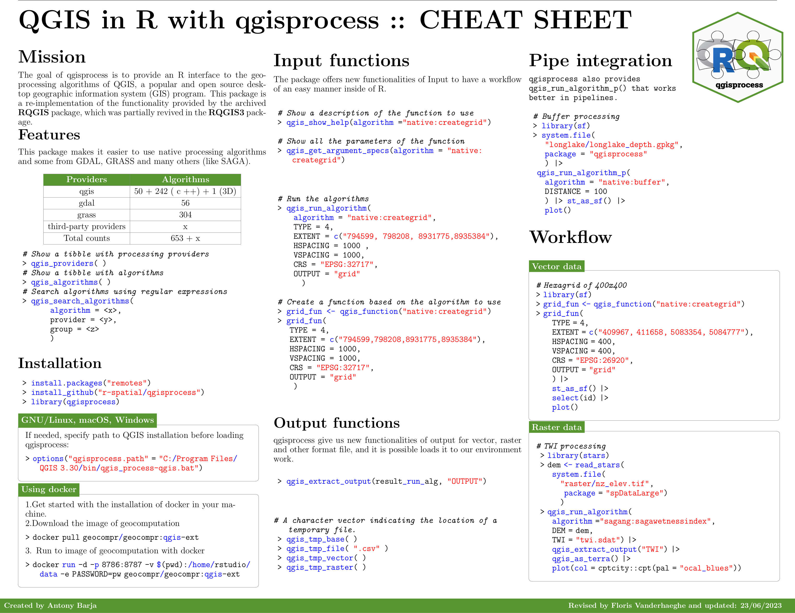

Click the cheatsheet to enlarge. -- [Download as PDF](https://github.com/ambarja/cheatsheet-qgisprocess/raw/main/pdf/english/qgisprocess_en.pdf).

[{width="150%"}](https://r-spatial.github.io/qgisprocess/articles/img/qgisprocess_en.png)

\
Do you have an idea for improvement or do you see a mistake? Make an issue at the cheat sheet 
<button type="button" class="btn btn-warning" style="--bs-btn-padding-y: .25rem; --bs-btn-padding-x: .5rem; --bs-btn-font-size: .75rem;">
  <a href='https://github.com/ambarja/cheatsheet-qgisprocess/issues/new'>repository!</a>
</button>

