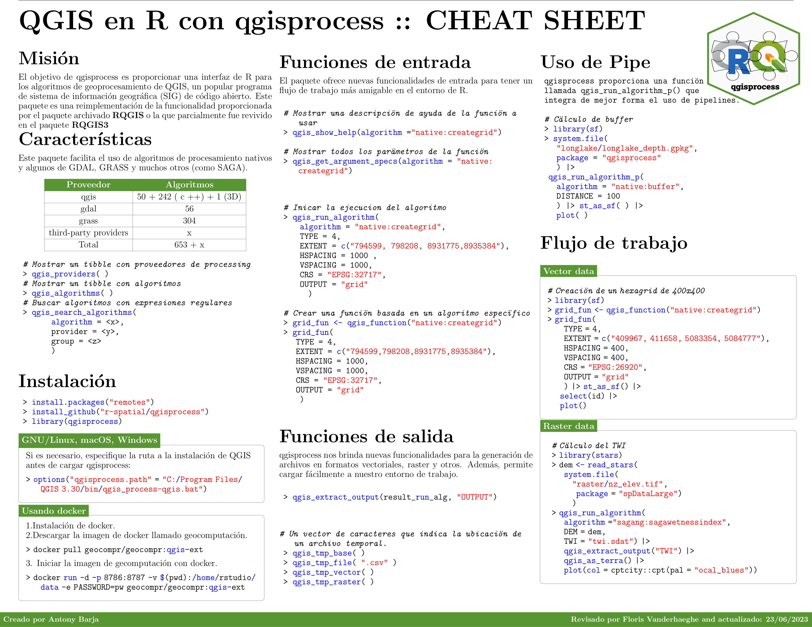

Haga clic en la hoja de trucos para ampliar. -- [Descargar como PDF](https://github.com/ambarja/cheatsheet-qgisprocess/raw/main/cheatsheet/es/qgisprocess_es.pdf).

[{width="150%"}](img/qgisprocess_es.png)

\
¿Tienes una idea de mejorar o ves algún tipo de error? Haga un 'issue' en la hoja de trucos del <button type="button" class="btn btn-warning" style="--bs-btn-padding-y: .25rem; --bs-btn-padding-x: .5rem; --bs-btn-font-size: .75rem;">
  <a href='https://github.com/ambarja/cheatsheet-qgisprocess/issues/new'>repositorio.</a>
</button>
